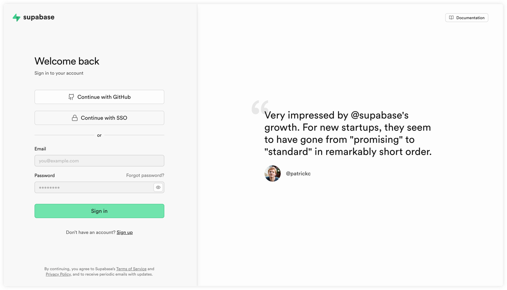

# 登录界面

ztract 无需注册，只需要输入邮箱，系统自动发送验证码，用户输入验证码自动完成登录。
同时支持 Google 账号登录。

## 页面布局

- 参考 supabase 的登录界面布局，
- 左侧部分占比大概 40%，左侧顶部放置产品 logo，中部为输入框、按钮表单；
- 右侧占比 60%，与 supabase 一样，显示用户的评价，开发阶段你随便放一个用户的评价；
- 左侧包含一个 Email 输入框，一个 Sign In 按钮、分割线，分割线下部是 Google 登录按钮，Google 的 logo 需要用彩色的。
- Sign In 按钮点击后，调用 /auth/send-otp 发送验证码，页面呈现 OPT 输入框
- 底部有文字链接，内容为： By continuing, you agree to Ztract’s Terms of Service and Privacy Policy, and to receive periodic emails with updates.

## 页面路由

页面路径为 /sign-in